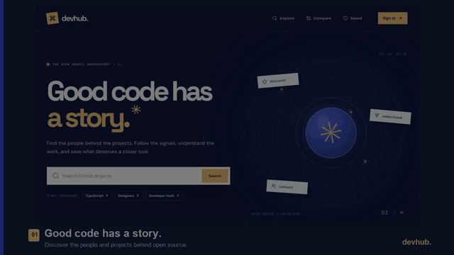

# DevHub

A full-stack GitHub discovery workspace. Search public developers and repositories, inspect project statistics and activity, compare two profiles or projects, and save favourites to a personal dashboard.

**Live site:** [devhub-sandy.vercel.app](https://devhub-sandy.vercel.app)

## 60-second demo



[Download the full-resolution MP4](https://github.com/MaanavKrishna/DevHub/raw/refs/heads/main/docs/devhub-demo-60s.mp4). The walkthrough shows live search, developer and repository details, activity, comparisons, account pages, and a dashboard with saved items.

## Stack

- **Next.js App Router + TypeScript** for pages and REST route handlers in one deployment
- **PostgreSQL + Prisma** for persistent accounts, sessions, and favourites
- **Better Auth** for email and password registration, login, and secure sessions
- **GitHub REST API** for live public data, with short-lived server caching and rate-limit feedback
- **CSS design system** with reusable controls, layouts, responsive breakpoints, and accessible states
- **Vitest** for analytics, validation, and GitHub error behaviour

## What is included

| Area               | Features                                                                                                |
| ------------------ | ------------------------------------------------------------------------------------------------------- |
| Discover           | Repository and developer search, shareable query URLs, pagination                                       |
| Developers         | Profile, bio, public statistics, recently updated repositories                                          |
| Repositories       | Stars, forks, issues, subscribers, language distribution, contributors, recent commits, project details |
| Personal workspace | Register, sign in, save and remove favourites, private dashboard                                        |
| Compare            | Side-by-side repository and developer comparisons                                                       |
| Reliability        | Loading, empty, not-found, unavailable, and rate-limit states; GitHub request caching                   |

GitHub remains the source for public profile and repository data. DevHub stores account data and a minimal snapshot for each favourite.

## Local setup

**Requirements:** Node.js 22 or newer and PostgreSQL.

1. Install dependencies: `npm ci`
2. Copy `.env.example` to `.env.local` and set:
   - `DATABASE_URL`: PostgreSQL connection string
   - `BETTER_AUTH_SECRET`: a random value of at least 32 characters
   - `BETTER_AUTH_URL`: `http://localhost:3000` locally
   - `GITHUB_TOKEN`: optional GitHub token for a higher API allowance; keep it server-side
3. Apply the database schema: `npm run db:migrate`
4. Start the app: `npm run dev`
5. Open `http://localhost:3000`

The development and build commands generate Prisma Client automatically. Never commit `.env.local` or a GitHub token.

## Deployment from GitHub

GitHub stores the repository and runs checks; **Vercel runs the Next.js site and REST API**, while Prisma Postgres stores user data. GitHub Pages cannot run this app's server routes or database-backed login.

1. Push this repository to GitHub.
2. Provision a PostgreSQL database and connect it to the Vercel project. The Prisma Postgres Marketplace integration supplies `DATABASE_URL` automatically.
3. Import the GitHub repository into Vercel as a Next.js project.
4. Set `DATABASE_URL`, `BETTER_AUTH_SECRET`, `BETTER_AUTH_URL` (the production site URL), and optionally `GITHUB_TOKEN` in Vercel project environment variables. Do not prefix secrets with `NEXT_PUBLIC_`.
5. Deploy. Vercel builds and serves the site and `/api` routes together. Its production build applies pending Prisma migrations before compiling; preview builds do not migrate the shared database.

`npm run build` runs Prisma Client generation and a production Next.js build. For previews, set a preview-compatible `BETTER_AUTH_URL` or configure a stable custom preview domain before testing authentication redirects.

## REST API

| Method   | Route                                               | Description                                                    |
| -------- | --------------------------------------------------- | -------------------------------------------------------------- |
| GET      | `/api/search?type=users\|repositories&q=...&page=1` | Paginated GitHub search                                        |
| GET      | `/api/developers/:login`                            | Developer profile and recent repositories                      |
| GET      | `/api/repositories/:owner/:repo`                    | Repository statistics, languages, contributors, recent commits |
| GET      | `/api/favorites`                                    | Current user's saved items                                     |
| POST     | `/api/favorites`                                    | Save a developer or repository                                 |
| DELETE   | `/api/favorites`                                    | Remove a saved item                                            |
| GET/POST | `/api/auth/*`                                       | Better Auth account and session routes                         |

Favourite routes require a signed-in session. Public GitHub routes report `404` for missing items, `429` for rate limits, and `502` for upstream failures. GitHub search exposes at most the first 1,000 matches. Optional sections show “unavailable” when GitHub cannot return them.

## Checks

```bash
npm run lint
npm run typecheck
npm test
npm run build
```

The app has also been exercised against a temporary PostgreSQL database for registration, authenticated favourites, unauthorized access, migration, and live GitHub search. For CI, `.github/workflows/ci.yml` runs the static checks and tests on pushes and pull requests.

## Project structure

```text
src/app/                  Pages, loading/error states, REST route handlers
src/components/           Reusable UI and interactive controls
src/styles/               Page and responsive styles built on shared tokens
src/lib/                  GitHub client, auth, Prisma, validation, analytics
prisma/                   Schema and SQL migration
```

## Data and rate limits

The backend calls GitHub, so credentials never reach the browser. Public requests use Next.js fetch revalidation (60 seconds for search; longer for detail sections). A `GITHUB_TOKEN` is recommended for production. When GitHub responds with a rate limit, DevHub displays a retry message and the reset time if GitHub supplies one. Repository language percentages are based on bytes returned by GitHub; a displayed “<1%” means the language is present but rounds below one percent.
